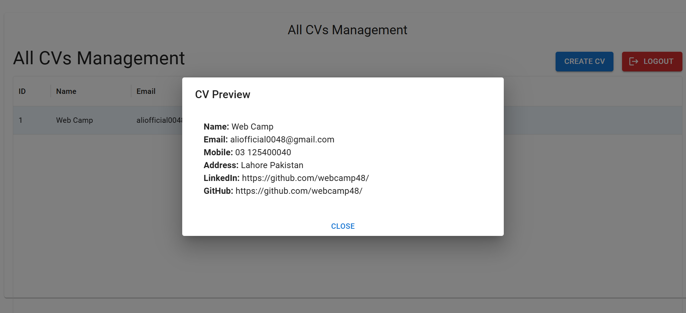
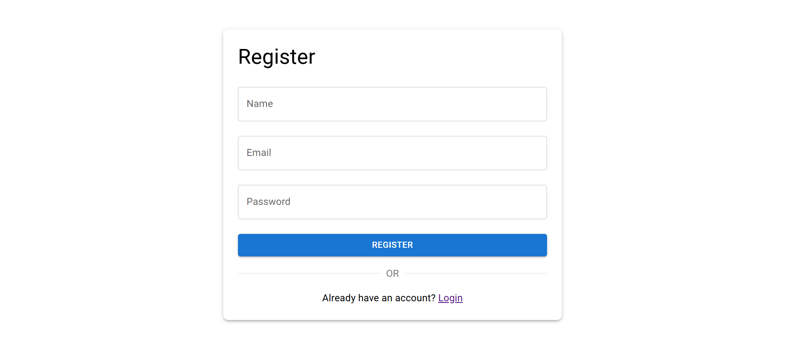
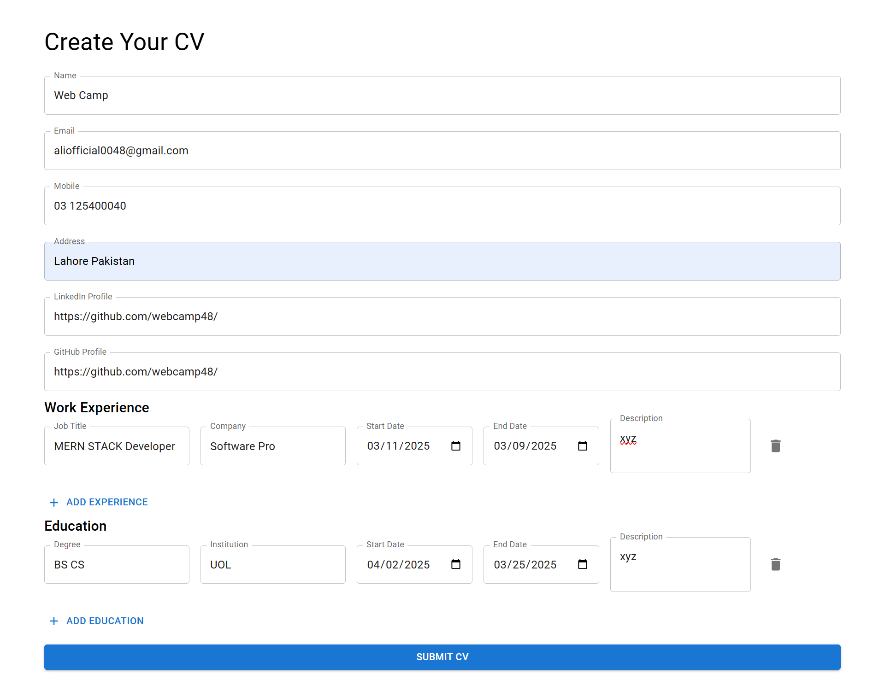
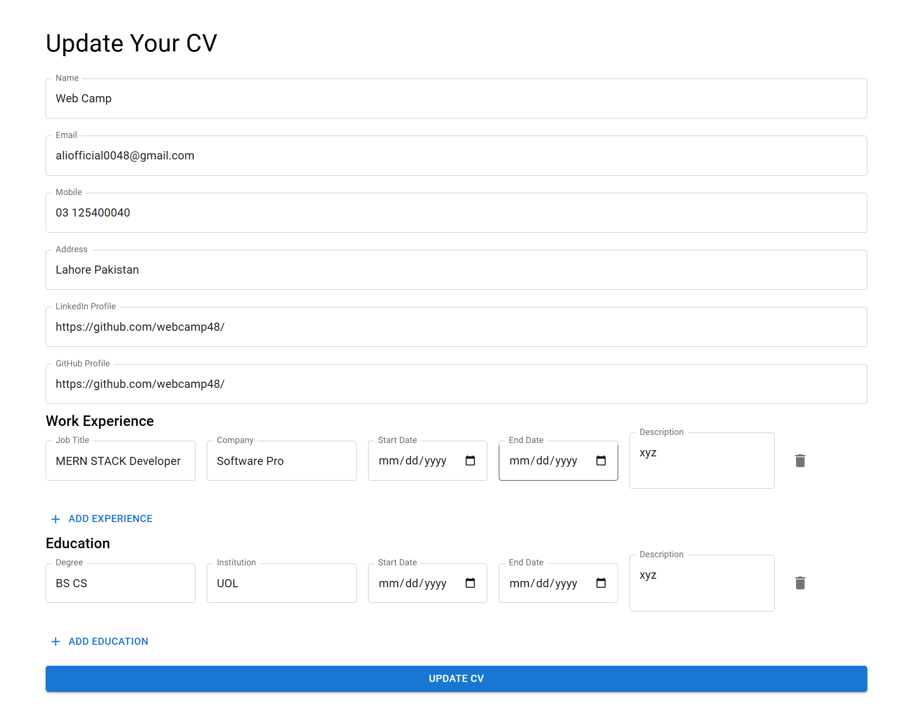

# CV Management System

## Project Overview
The **CV Management System** is a powerful web application built using the **MERN stack**. It enables users to create, manage, and download professional CVs with ease. The system includes secure user authentication with **OTP validation**, **personalized CV management**, and an intuitive interface.

## Live Demo
[Live Demo Link](#) <!-- Add your deployment link when available -->

## Key Features

### 1. User Authentication
- Secure **registration** and **login** functionality
- Authentication via **JWT (JSON Web Token)**
- **OTP validation** for enhanced security
- **Protected routes** for authenticated users only

### 2. User-Specific CV Management
- Each user can create and manage their own CVs
- Secure data isolation (**users can only access their own CVs**)
- **Complete CRUD operations** (Create, Read, Update, Delete)

### 3. CV Creation
- Comprehensive form for inputting:
  - **Personal Details**: Name, email, phone, address, LinkedIn, GitHub, etc.
  - **Work Experience**: Job title, company, dates, description
  - **Education**: Degree, institution, dates, description
- Support for multiple **work experience** and **education** entries

### 4. CV Preview and Download
- **Real-time preview** of the CV
- **PDF download** functionality
- **Multiple CV templates** for customization

## Technology Stack

- **Frontend**: React.js with Vite, Context API for state management, MUI (Material-UI)
- **Backend**: Node.js, Express.js
- **Database**: MongoDB
- **Authentication**: JWT, OTP validation
- **Other Tools**: PDF generation library, useForm validation

## Database Design

The application uses MongoDB with the following collections:

1. **Users Collection**
   - User credentials
   - Profile information
   - Authentication details

2. **CVs Collection**
   - Personal information
   - Work experience entries
   - Education details
   - References to user IDs

## Installation and Setup

### Prerequisites
- **Node.js** (version 22.14.0)
- **npm** or **yarn**
- **MongoDB** (local installation or MongoDB Atlas account)

### Clone the Repository

```bash
# Clone the repository
git clone https://github.com/webcamp48/cv-management-system/

# Navigate to project directory
cd cv-management-system
```

## Project Structure
```
cv-management-system/
├── server/
│   ├── @types/
│   ├── constants/
│   ├── services/
│   │   ├── email/
│   │   ├── ejs/
│   ├── config/
│   ├── controllers/
│   ├── middleware/
│   ├── models/
│   ├── routes/
│   ├── utils/
│   ├── .env
│   ├── package.json
│   ├── app.js
│   └── server.js
│   ├── tsconfig.json
├── client/
│   ├── public/
│   ├── src/
│   │   ├── api/
│   │   ├── hooks/
│   │   ├── store/
│   │   ├── assets/
│   │   ├── components/
│   │   ├── pages/
│   │   ├── utils/
│   │   ├── App.jsx
│   │   └── main.jsx
│   ├── .env
│   ├── index.html
│   ├── package.json
│   ├── vite.config.js
├── .gitignore
├── README.md
└── package.json
```

## Running the Application

### Backend (Server)
```bash
cd server
npm install  # Install dependencies
npm run dev  # Start the backend server
```

### Frontend (Client)
```bash
cd client
npm install  # Install dependencies
npm run dev  # Start the frontend
```


## Screenshots

### Home Page


### Sign-Up Page


### Create CV Page


### Update CV Page



## Contributing
Contributions are welcome! Please submit a **Pull Request** for any enhancements.

## License
This project is licensed under the **MIT License**. See the LICENSE file for details.

## Contact
For any inquiries, please reach out to: [webcamp48@gmail.com](mailto:webcamp48@gmail.com)

---


